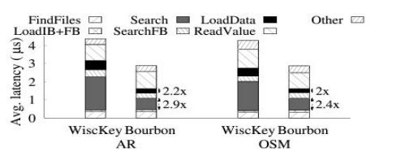
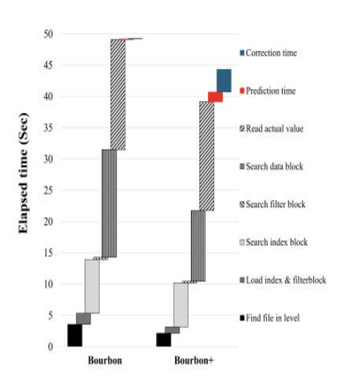
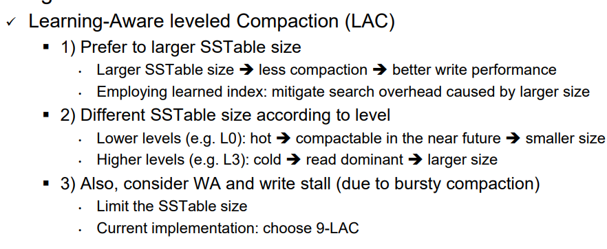

1. 27 페이지를 보면 Wisckey와 Bourbon의 차이가
- 7 단계 중에서 3), 5), 6) 단계에서는 이득이 있고 다른 단계를 동일한데 맞니?
  - 네 맞습니다.
  - 이 부분을 논문에서 디테일하게 설명 
- 반면 31 페이지 Bourbon+는 다른 단계에서도 이득을 얻을 수 있고: 예를 들어 단계 1)과 단계 2)에서도
- 31 페이지 성능 그림을 27 페이지의 Bourbon과 동일한 label을 사용하여 다시 그리면 좋을 듯...

   

2. 28 페이지에 rethinking trade-off를 논의 했는데,
- 꼼꼼하게 읽어보고 우리의 motivation이 맞는지 확인 부탁..
(혹시 추가 또는 변경하고 싶은 내용이 있으면 자유롭게 수정해도 됩니다.^^)

- borbon의 compaction 개수 그래프 & compaction data  추가 

3. 28 페이지 동기에 따라 새로운 기법 2개를 제안하였는데
- 29 페이지의 SEC와 30 페이지의 LAC
  - SEC에서 error bound 32 이상의 그래프 추가 
    - Balance the prediction and correction time and memory usage  

- 각 기법의 동작을 이렇게 정리해도 되는지, 또는 변경이 필요한지 확인 부탁..

4. 현재 논문에서 여러 실험 결과가 LevelDB나 Wisckey를 기반으로 하였는데,
- 모두 Bourbon을 기반으로 실험한 것으로 바꾸는 것이 어떨까?
- 초반 motivation의 일부는  leveldb 나머지는 bourbon으로 실험 진행 

---

Question 1: the below results are total latency of all lookups while Bourbon’s results are per lookup latency. Right?
- How many lookups? Do you also use SATA SSD? Or NVMe SSD?
- Why you use total instead of individual?

Q2: Bourbon uses the following lookup steps.
- 1) Findfiles, 2) LoadIB+FB, 3) SearchIB or SearchModel(prediction), 4) SearchFB, 5) LoadDB or LoadChunk, 6) SearchDB or SearchKey (correction) , 7) ReadValue
- By the way, in your figure, where is LoadData (LoadDB or LoadChunk)?
- From Bourbon, I think SearchIB is replaced with SearchModel (prediction) and SearchDB is replaced with correction. But, this figure has both. What are differences between SearchDB and correction?

Q3: In Bourbon’s results, the total search overheads are roughly 40% for Wisckey and 20% for Bourbon è refer to the figure of previous slide 
- But in your results, total search overheads (SearchIB + SearchDB) are 50% or larger. Why?

Q4: In Bourbon’s results, except search, other components are hardly changed.
- But, in your results, Findfiles and LoadIB+FB are changed noticeably. Why?

In this evaluation, I think your utilize both LAC (Learned-aware compaction) and larger error-bound
-  1) LAC è larger SSTable è smaller # of SSTable files è less Findfiles overhead (matched well with our results below)
- 2) Q1: Why the LoadIB+FB is decreased in Bourbon+? I guess, Larger error-bound è less strict learning è less # of segments è less IB size è less LoadIB overhead è Can you measure the # of segments and the IB size from Bourbon and Bourbon+? I guess LAC also affect this decreasing. Please show quantitative data.
-  7) Larger error-bound è less strict learning è less # of segments è less prediction time.

Q2: Bourbon+ increases the prediction overhead. Why? Could you explain with data?

- 8) Larger error-bound è more correction time (matched well with our results below)
- 3) In search index block, both utilize model for prediction. Right? Then, Q3: Why Bourbon+ outperforms Bourbon? I think this overhead depends on the model size, # of SSTable accesses, and the # of prediction trials. Could you measure these?
- 5) In search data block, Q4 I also wonder why Bourbon+ outperforms Bourbon.
-  4) Filter block: same overhead. reasonable
 - 6) ReadValue: same overhead. Also reasonable